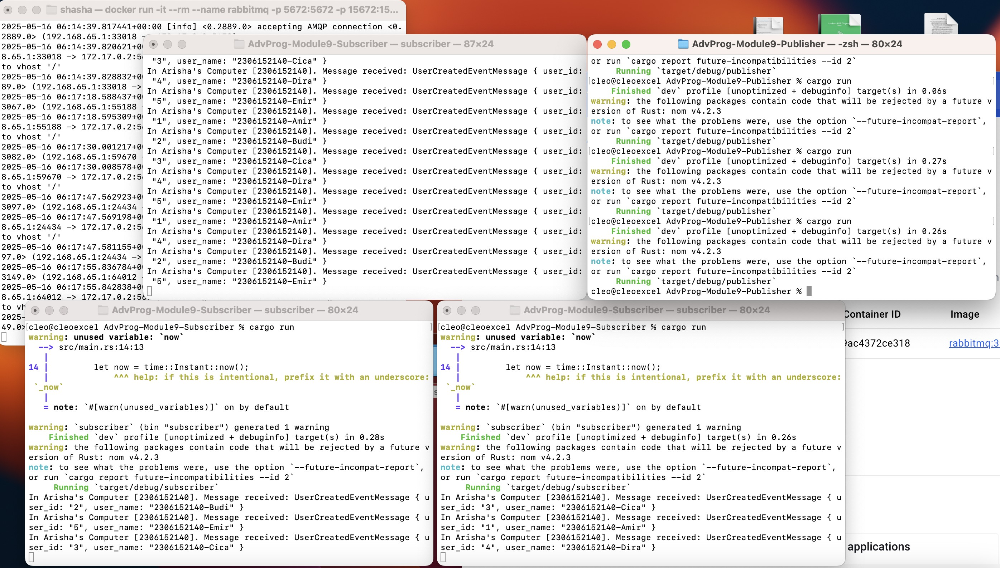
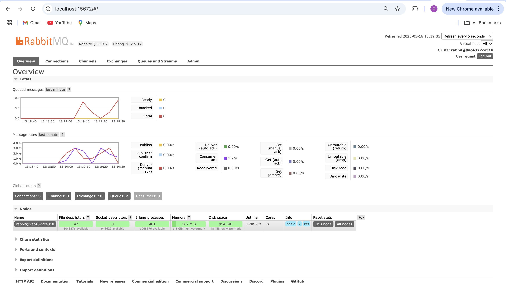

1. **What is amqp?**
- AMQP (Advanced Message Queuing Protocol) adalah protokol terbuka untuk pertukaran pesan (messaging) antar-aplikasi. Protokol ini menjamin pesan dikirim, diterima, dan diproses dengan andal dalam arsitektur berbasis antrian.
2. **What does it mean? guest:guest@localhost:5672 , what is the first guest, and what
is the second guest, and what is localhost:5672 is for?**
- guest (pertama): username default untuk autentikasi.
- guest (kedua): password yang dipakai bersama username di atas.
- localhost:5672: alamat localhost yang berarti menjalankan di mesin lokal, dan 5672 adalah port standar tempat broker AMQP mendengarkan koneksi.

3. **Simulation slow subscriber**

Total antrean di “Queued messages” (≈20) yang merupakan jumlah pesan yang sudah dikirim tapi belum di-ack oleh subscriber. Karena publisher mengeluarkan 2 pesan/detik sementara subscriber hanya mem-ack 1 pesan/detik, setiap detik muncul 1 pesan baru yang tertunda setelah sekitar 20 detik, backlog-nya jadi ≈20 pesan.

4. **Reflection and Running at least three subscribers**

Pada percobaan ini saya menjalankan 3 subscriber paralel. Broker membagi pesan secara round-robin, sehingga antrean berkurang jauh lebih cepat dibanding hanya 1 atau 2 konsumer RabbitMQ queue mendukung banyak konsumer; pesan didistribusikan merata. Selain itu, menambah konsumer = meningkatkan throughput konsumsi. Ide perbaikan atur prefetch(QoS) misal `channel.basic_qos(1, …)` agar tiap subscriber hanya mengambil 1 pesan sekaligus sehingga mencegah overload, implementasi retry atau dead-letter pada pesan yang gagal diproses, gunakan thread-pool atau runtime async (Tokio) untuk menangani pesan secara concurrent di dalam satu proses subscriber, konfigurasikan queue dan exchange sebagai durable serta set `persistent` pada message untuk memastikan ketahanan jika broker restart.

